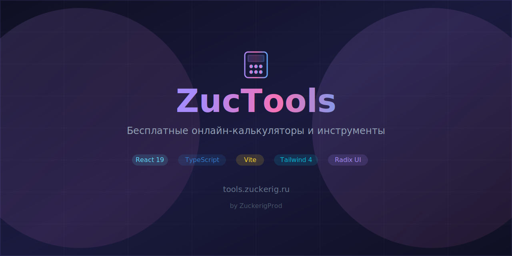

# ZucTools



Бесплатные онлайн-калькуляторы и инструменты для бухгалтерии, налогов и финансов. Создано **[ZuckerigProd](https://t.me/ZuckerigProd)**.


## Сайт

**https://tools.zuckerig.ru/**

## Возможности

### Бухгалтерия
- **Калькулятор зарплаты** — расчёт «до вычета» и «на руки» с учётом НДФЛ
- **Стоимость сотрудника** — полная стоимость для работодателя со взносами

### Калькуляторы
- **НДС** — начисление и выделение по ставкам 5%, 7%, 10%, 18%, 20%, 22%
- **НДФЛ** — прогрессивная шкала с визуализацией ступеней
- **УСН** — расчёт налога по упрощённой системе
- **Проценты** — вычисление, прибавление и вычитание процентов
- **Сумма прописью** — число в текст для платёжных документов
- **Дни между датами** — рабочие и календарные дни с производственным календарём
- **Страховые взносы ИП** — фиксированные взносы и 1% с доходов свыше 300 000 ₽
- **Декретные, больничный, отпускные** — пособия и компенсации
- **Компенсация при увольнении** — за неиспользованный отпуск
- **Пени** — за просрочку налогов и взносов
- **Выбор налогообложения** — сравнение ОСНО, УСН, Патент, НПД
- **Госпошлина в суд** — для судов общей юрисдикции и арбитражных

### Финансы
- **Калькулятор кредита** — аннуитетные и дифференцированные платежи с графиком
- **Калькулятор вклада** — проценты с капитализацией и пополнением

### Справочники
- **Производственный календарь** — праздники и рабочие дни

### Проверка
- **Проверка ИНН** — валидация ИНН, ОГРН, СНИЛС, КПП и расчётных счетов

## Стек

| Слой | Технологии |
|------|-----------|
| Frontend | React 19, TypeScript, Vite 7 |
| UI | Tailwind CSS 4, Radix UI, Lucide Icons |
| Routing | React Router 7 |
| Animations | tw-animate-css |

## Запуск

```bash
npm install
npm run dev
```

Открыть `http://localhost:3000`

## Сборка

```bash
npm run build
```

## Лицензия

Проприетарное ПО. Все права защищены.
